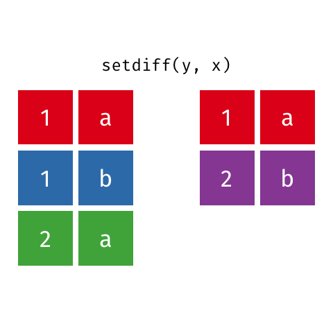

# Outline

.pull-left[ .center-left[
## 1. *Hello wo**R**ld*
## 2. *Data wrangling*
## 3. Programación en **R**
## 4. Comunicar
]]

--

.pull-right[ .center-right[
```{r fig:data-science, echo = FALSE, out.width = "100%", fig.align='center'}
knitr::include_graphics("my_images/data-science.png")
```
.center[
Tomado de [r4ds](https://r4ds.had.co.nz/index.html). 
]
]]

???
* Tidying your data: storing it in a consistent form that matches the semantics of the dataset with the way it is stored
 + When your data is tidy, each column is a variable, and each row is an observation
* Wrangling =  Tidying + Transforming: getting your data in a form that’s natural to work with often feels like a fight!
* En estas 2 sesiones nos saltaremos la parte de Modelar, porque ese es justamente el objetivo de todo el curso!
* It doesn’t matter how well your models and visualisation have led you to understand the data unless you can also communicate your results to others.

---
class: inverse, center, middle

# 1. *Hello wo**R**ld*

---
# 1. Hello woRld


```{r fig:cover-r4ds, echo = FALSE, out.width = "30%", fig.align='center'}
knitr::include_graphics("my_images/cover.png")
```
.center[
r4ds 1era y 2da edición **gratis** en: <https://r4ds.had.co.nz/index.html>.
]


---

# 1. Hello woRld

### Bibliografía recomendada

Wickham, Hadley, and Garrett Grolemund. 2017. R for Data Science: Import, Tidy, Transform, Visualize, and Model Data. 1st ed. O’Reilly Media. (Versión online libre: [r4ds](https://r4ds.had.co.nz/index.html)).

Wickham, Hadley, Çetinkaya-Rundel, Mine, and Grolemund, Garrett. 2023. R for Data Science: Import, Tidy, Transform, Visualize, and Model Data. 2nd ed. O’Reilly Media. (Versión online libre: [r4ds2e](https://r4ds.hadley.nz/)).

Wickham, Hadley. 2015. Advanced R. Chapman & Hall. (Versión online libre: <http://adv-r.had.co.nz/>)

Holtz, Yan. 2018. The R Graph Gallery. Recurso online: <https://www.r-graph-gallery.com/index.html>


Cualquier cosa escrita por Wickham, Hadley!!!

---
# 1. Hello woRld

### Necesitaremos:
* **R** (descargar en [CRAN](https://cloud.r-project.org/))
* RStudio (descargar [aquí](https://rstudio.com/products/rstudio/download/))
* Paquetes (fundamentalmente `tidyverse`, ver [aquí](https://www.tidyverse.org/))
 + Instalar: `install.packages("tidyverse")`
 + Cargar: `library(tidyverse)`

```{r load-tidyverse, echo=FALSE, message=FALSE}
library(tidyverse)
```
--
### Recursos:

* *RStudio Cloud* (versión libre limitada): <https://rstudio.com/products/cloud/>

--
* *Tips & Shortcuts*: <https://appsilon.com/rstudio-shortcuts-and-tips/>

--
* *Themes* (muy *geek*): <https://www.garrickadenbuie.com/project/rsthemes/>


???

* Entramos en CRAN
* Entramos en el sitio de Rstudio
* Entramos en el sitio de tidyverse
* Pasamos a abrir R y luego RStudio para ver las facilidades de este último
* Estudiamos los diferentes paneles de RStudio

---

# 1. Hello woRld

### **R** como calculadora:

```{r ej:calculadora, eval = TRUE}
2 + 2
sin(pi/2)
```

--

### Crear un objeto nuevo (*asignamos* con " <- "):

```{r ej:asigna}
x <- 'Hello world!'
class(x)
x
```

---

# 1. Hello woRld

```{r fig:meme-asigna,echo = FALSE, out.width = "60%", fig.align='center'}

```

---
# 1. Hello woRld

### Funciones propias (*built-in*):

```{r ej:seq}
(y <- seq(from = 1, to = 10, length.out = 8))
y[2]
y[-2]
y[1:3]
```

???
* La única forma de aprenderse las *built-in functions* es programando!
* Se pueden consultar en la Ayuda de RStudio
* Preguntando a Google
* O usando las *Cheatsheets* de RStudio! <https://rstudio.com/resources/cheatsheets/>

---
# 1. Hello woRld

### Ya estamos listos para empezar a programar :)

* Trabajaremos en un *script* de **R**, no en la *Consola*
* Además lo haremos de forma segura y organizada creando un **RStudio Project**:
 + Ir a *File > New Project...*
 + Podemos crear un nuevo directorio donde guardar nuestros scripts, figuras, datos, etc.;
 + Por ejemplo, en el Escritorio creamos el proyecto "*intro_R*";
 + Siempre que trabajemos en este proyecto, "*intro_R*" será nuestro *Working Directory*
 + Ahora, creamos un nuevo script "*plots_mpg.R*" y a programar!


--

#### Pasamos al mini-**Notebook de Visualización (Nuevo Proyecto)**

<https://hhroig.github.io/IA-CD-practice-main/index.html>


---
# 1. Hello woRld

### Transformaciones con el paquete `dplyr`:

* Filtrar observaciones (filas) con `filter()`,
* Reordenar observaciones (filas) con `arrange()`,
* Seleccionar variables (columnas) con `select()`,
* Crear nuevas variables (columnas) aplicando transformaciones (funciones) a las ya existentes con `mutate()`,
* Resumir la información de muchos valores con `summarise()`,
* ... puede ser usado con `group_by()` que agrupa las observaciones de acuerdo a cierta variable categórica.

---
# 1. Hello woRld

### Tipos de variables:

--

* `int`: enteros (*integers*)
* `dbl`: números reales o en doble precisión (*doubles*)
* `chr`: vectores o cadenas de caracteres (*strings*)
* `lgl`: vectores lógicos o "booleanos" (*boolean*) que solo contienen `TRUE` o `FALSE` 
* `fctr`: categóricas o "factores" con niveles fijos (*factors*)
* `date`: fechas (*dates*) 

---
# 1. Hello woRld

### Comparaciones:

--

* `x < y`: ¿es `x` menor que `y`?
* `x > y`: ¿es `x` mayor que `y`?
* `x <= y` ("<="): ¿es `x` menor o igual que `y`?
* `x >= y` (">="): ¿es `x` mayor o igual que `y`?
* `x == y` ("=="): ¿es `x` igual a `y`?
* `x != y` ("!="): ¿es `x` distinto de `y`?


Estas operaciones se hacen elemento a elemento si `x` e `y` son vectores. Otra muy útil:

* `x %in% y`: ¿qué elementos de `x` están en `y`?

```{r ej:use-in}
c(1, 2, 3) %in% c(2, 4, 6, 8)
```


---
# 1. Hello woRld

### Comparaciones:

--

```{r ej:comparaciones}
x <- c(1, 2, 3)
y <- c(2, 1, 3)
x == y
x <= y
sqrt(2)^2 == 2
dplyr::near(sqrt(2)^2, 2)
```

---
# 1. Hello woRld

### Operadores lógicos (*Boolean operators*):

--

```{r fig:bool-oper, echo = FALSE, out.width = "70%", fig.align='center'}
knitr::include_graphics("my_images/transform-logical.png")
```
.center[
Tomado de [r4ds](https://r4ds.had.co.nz/index.html). 
]

---
# 1. Hello woRld

### Operadores lógicos (*Boolean operators*):

--

* Leyes de *De Morgan* ([Wiki](https://es.wikipedia.org/wiki/Leyes_de_De_Morgan)):

--

  + `!(x & y)` es lo mismo que `!x | !y`
--

  + `!(x | y)` es lo mismo que `!x & !y`

---
# 1. Hello woRld

### Datos perdidos (*Missing values*): 

* **R** los codifica como `NA` (*`N`ot `A`vailabe*);
--

* Las operaciones con ellos pueden resultar algo confusas;

```{r ej:opera-NA1}
NA > 5
10 == NA
NA + 10
NA / 2
```

---
# 1. Hello woRld

### Datos perdidos (*Missing values*): 

* Las operaciones con ellos pueden resultar algo confusas;

```{r ej:opera-NA2}
NA == NA

# ¿cuánto dinero tendré a los 50?
x <- NA
# ¿cuánto dinero tendré a los 55?
y <- NA
# ¿tendré la misma cantidad de dinero a los 50 y a los 55?
x == y
# ¡No lo sé!
```
---
# 1. Hello woRld

### Datos perdidos (*Missing values*): 

* Hay que tener cuidado al aplicar funciones a datos con `NA`;

```{r ej:funciones-NA}
x <- c(NA, 1:4, NA, 6)
x
mean(x)
sum(x)
```

---
# 1. Hello woRld

### Datos perdidos (*Missing values*): 

* Usando `is.na()`:

```{r ej:is_na}
x
sum(is.na(x))
mean(x[!is.na(x)])
mean(x, na.rm = T)
```

---
# 1. Hello woRld

### Funciones útiles (crear)

--

* Operaciones aritméticas: `+`, `-`, `^`, `*`, `/`, todas vectorizadas;
```{r ej:oper-aritm}
x <- 1:3
(y <- x^2)
y/x
y <- c(y, 10)
y/x
```


---
# 1. Hello woRld

### Funciones útiles (crear)

--

* Aritmética modular: `%/%` (división entera) and `%%` (resto de la división);

```{r ej:aritm-modular}
x <- 5
y <- 2
x %/% y
x %% y
x == y * (x %/% y) + (x %% y)
```
--

* Logaritmos: `log()`, `log2()`, `log10()`.

---
# 1. Hello woRld

### Funciones útiles (crear)

--

* *Lags*: `lag()` y `lead()`... ¡no olvides cargar `dplyr`!

```{r ej:lags}
z <- 1:10
lag(z)
lead(z)
z - lag(z)
```
---
# 1. Hello woRld

### Funciones útiles (crear)

--

* Cantidades acumuladas y agregados móviles: **R** base incluye: `cumsum()`, `cumprod()`, `cummin()`, `cummax()`; y `dplyr` también tiene `cummean()` para hacer una media acumulativa;

```{r ej:cum_funs}
z
cumsum(z)
cumprod(z)
cummean(z)
```

---
# 1. Hello woRld

### Funciones útiles (resumir)

--

* Localización: `mean()` y `median()`, esta última más robusta;

--

* Dispersión: [desviación estándar](https://es.wikipedia.org/wiki/Desviaci%C3%B3n_t%C3%ADpica) `sd()`, [rango intercuartílico](https://es.wikipedia.org/wiki/Rango_intercuart%C3%ADlico) `IQR()`, [desviación media](https://es.wikipedia.org/wiki/Desviaci%C3%B3n_media) `mad()`. 

--

* Medidas de rango: `min()`, `quantile( ... , p)`, `max()`.

---
# 1. Hello woRld

### Funciones útiles (resumir)

--

* Medidas de posición: `first(x)`, `nth()`, `last()`;

```{r ej:posicion}
x <- c(5, 3, 6, 2)
first(x) == x[1]
nth(x, 2) == x[2]
last(x) == x[length(x)]
```


---
# 1. Hello woRld

### Funciones útiles (resumir)

--

* Contar:

```{r ej:contar}
x <- c(5, 3, 6, 2, 0, -5, 3)
unique(x)
length(unique(x)) # == dplyr::n_distinct(x)
sum(x > 2)
mean(x > 0)
```

---
# 1. Hello woRld

### Pipes!

.pull-left[ .center-left[
* Permiten reescribir operaciones que se leen:
 + de izquierda a derecha,
 + de arriba a abajo.
* Paquete [`magritrr`](https://cran.r-project.org/web/packages/magrittr/vignettes/magrittr.html).
* Es uno de los ingredientes claves de [`tidyverse`](https://magrittr.tidyverse.org/) y se carga con `dplyr` directamente.
* Excepción: uso limitado con `ggplot`, aunque tenemos [`ggvis`](https://ggvis.rstudio.com/)...
]]

.pull-right[ .center-right[
```{r fig:logo-pipe1, echo = FALSE, out.width = "30%", fig.align='center'}
knitr::include_graphics("my_images/logo-pipe.png")
```
]]

---
# 1. Hello woRld

### Pipes!

.pull-left[ .center-left[
```{r ej:usa-pipe, eval =FALSE}
piped <- 
  x %>%
  f(y) %>%
  g(z)

not_piped <-  
  g(f(x, y), z)
```
]]

.pull-right[ .center-right[
```{r fig:logo-pipe2, echo = FALSE, out.width = "30%", fig.align='center'}
knitr::include_graphics("my_images/logo-pipe.png")
```
]]

---
# 1. Hello woRld

### Pipes!

.pull-left[ .center-left[
```{r ej:usa-pipe2, eval =FALSE}
piped <- 
  x %>%
  f(y) %>%
  g(z)

not_piped <-  
  g(f(x, y), z)
```
#### Pasamos al **Notebook Transformaciones de Datos**

<https://hhroig.github.io/IA-CD-practice-main/transforma.html>

]]

.pull-right[ .center-right[
```{r fig:logo-pipe3, echo = FALSE, out.width = "30%", fig.align='center'}
knitr::include_graphics("my_images/logo-pipe.png")
```
]]


---
# 1. Hello woRld

### Análisis Exploratorio de Datos

* Exploración sistemática de los datos mediante transformaciones y la visualización.

--
* Te permite generar y responder cuestiones sobre tus datos.

--
* No es un proceso con reglas estrictas.

--
* Una parte importante del AED es la limpieza de tus datos (outlieres, errores de formato, `NA`s, etc.).


---
class: inverse, center, middle

# 2. *Data wrangling*

---

# 2. *Data wrangling*

```{r fig:wrangle_meme, echo = FALSE, out.width = "80%", fig.align='center'}

```

---

# 2. *Data wrangling*

## 2.1 Tipos de datos en **R**
## 2.2 Importar datos externos
## 2.3 Datos ordenados (*tidy*)
## 2.4 Datos relacionales (*relational*)

---

# 2.1 Tipos de datos en **R**

### Tibbles:

--
* Los *tibbles* son como los `data.frame` tradicionales de **R**,

--
* Nos hacen la vida "más fácil"...

--

* Para ver la diferencia, intenta esto:

```{r ej:tibble1, eval=FALSE }
iris
as_tibble(iris)
```

--

* Para crear tibbles:

```{r ej:tibble2, eval=FALSE }
tibble(
  x = 1:5, 
  y = 1, 
  z = x ^ 2 + y
)
```

--

* ¿Puedes crear un `data.frame` de esta misma forma?


---

# 2.1 Tipos de datos en **R**

### Tibbles:

* Pueden tener nombres de columna *non-syntactic*:

```{r ej:tibble3, eval=TRUE }
tibble(
  `:)` = "smile", 
  ` ` = "space",
  `2000` = "number"
)
```

---

# 2.1 Tipos de datos en **R**

### Tibbles:

* Transposed tibbles (pequeñas cantidades de datos) :

```{r ej:tribble, eval=TRUE }
tribble(
  ~x, ~y, ~z,
  #--|--|----
  "a", 2, 3.6,
  "b", 1, 8.5
)
```


---

# 2.1 Tipos de datos en **R**

### Tibbles:

* Print por defecto de 10 observaciones y la columnas que quepan:

```{r ej:tibble_print1, eval=FALSE }
nycflights13::flights %>% 
  print()
```

* Print personalizado:

```{r ej:tibble_print2, eval=FALSE }
nycflights13::flights %>% 
  print(n = 15, width = Inf)
```

--

* Siempre tendremos la opción `View()`...

---

# 2.1 Tipos de datos en **R**

### Tibbles:

* Subsetting:

```{r ej:tibble_subset}
df <- tibble(x = runif(5),  y = rnorm(5)) 

# Usando el nombre de la variable:
df$x
df[["x"]]

# Usando la posición de la variable:
df[[1]]
```

---

# 2.1 Tipos de datos en **R**

### Tibbles:

* Usando *pipes*:

```{r ej:tibble_pipes}
df %>% .$x
df %>% .[["x"]]
```

--

* Si algún método no te funciona con los tibbles:

```{r ej:tibble2df}
tb_2_df <- as.data.frame(df)

class(tb_2_df)
```

---

# 2.1 Tipos de datos en **R**

### Vectores:

* Son la estructura de datos de R base,

--
* Los paquetes que hemos visto (ggplot2, dplyr, tidyr, ...) funcionan con tibbles,

--
* En la práctica trabajamos más con vectores.


---

# 2.1 Tipos de datos en **R**

### Vectores:

#### Atomic

--

  * logical
  * integer (numeric)
  * double (numeric)
  * character
  * complex
  * raw

--

#### Lists

--

  * También llamados *recursive vectors* porque pueden contener otras listas.

---

# 2.1 Tipos de datos en **R**

### Atomic vectors 

#### Logical

* Solo toman 3 valores: `TRUE`, `FALSE` o `NA`.

--

#### Complex

```{r}
typeof(1 + 2i)
sqrt(-1+0i)
sqrt(as.complex(-1)) 
```

---

# 2.1 Tipos de datos en **R**

### Atomic vectors 

#### Numeric

--

* Los *integers* solo toman valores enteros o `NA`.

--

```{r}
typeof(1)
typeof(1L)
```

--

* Los *double* (doble precisión) toman valores reales, incluyendo: `NA`, `NaN`, `Inf` y `-Inf`. 

--

```{r}
c(-1, 0, 1) / 0
```

---

# 2.1 Tipos de datos en **R**

### Atomic vectors 

#### Character

* Vectores de *strings* (cadenas de caracteres).

--

```{r}
string1 <- "Esto es un string"
string2 <- 'Si queremos incluir una "cita" dentro de un string'
```

#### Raw

--

* Almacena bytes... cada número hexadecimal representa un byte de información:

--

```{r}
(y <- charToRaw(string1))
typeof(y)
```


---

# 2.1 Tipos de datos en **R**

### Lists

```{r ej:lists1}
x <- list(1, 2, 3)
x

# estructura de la lista:
str(x)

```

---

# 2.1 Tipos de datos en **R**

### Lists

```{r}
# podemos añadir nombre a los elementos:
x_named <- list(a = 1, b = 2, c = 3)
str(x_named)

# pueden contener diferentes tipos de variables:
y <- list("a", 1L, 1.5, TRUE)
str(y)
```

---

# 2.1 Tipos de datos en **R**

### Lists

```{r}
a <- list(a = 1:3, b = "a string", c = pi, d = list(-1, -5))
```

--

```{r fig:list-subset, echo = FALSE, out.width = "35%", fig.align='center'}
knitr::include_graphics("my_images/lists-subsetting.png")
```
.center[
Tomado de [r4ds](https://r4ds.had.co.nz/index.html). 
]


---

# 2.1 Tipos de datos en **R**

### Lists

* `[` extrae una sub-lista. El resultado es también una lista.

--

* `[[` extrae un elemento de una lista. Elimina un nivel de jerarquía de la lista.

--

* `$` es un atajo para extraer elementos con nombre de una lista. Funciona igual que `[[`, sin tener que usar las comillas: `[["var_name"]]`.


---

# 2.1 Tipos de datos en **R**

### Lists

* Pimentero `x` lleno de paquetes de pimienta:

```{r fig:pepper, echo = FALSE, out.width = "20%", fig.align='center'}
knitr::include_graphics("my_images/pepper.jpg")
```
.center[
Tomado de [r4ds](https://r4ds.had.co.nz/index.html). 
]

---

# 2.1 Tipos de datos en **R**

### Lists

* `x[1]` es otro pimentero con un solo paquete de pimienta:

```{r fig:pepper1, echo = FALSE, out.width = "20%", fig.align='center'}
knitr::include_graphics("my_images/pepper-1.jpg")
```
.center[
Tomado de [r4ds](https://r4ds.had.co.nz/index.html). 
]

---

# 2.1 Tipos de datos en **R**

### Lists

* `x[[1]]` es el primero de los paquetes de pimienta:

```{r fig:pepper2, echo = FALSE, out.width = "30%", fig.align='center'}
knitr::include_graphics("my_images/pepper-2.jpg")
```
.center[
Tomado de [r4ds](https://r4ds.had.co.nz/index.html). 
]


---

# 2.1 Tipos de datos en **R**

### Lists

* Finalmente, `x[[1]][1]` es la pimienta del primer paquete:

```{r fig:pepper3, echo = FALSE, out.width = "30%", fig.align='center'}
knitr::include_graphics("my_images/pepper-3.jpg")
```
.center[
Tomado de [r4ds](https://r4ds.had.co.nz/index.html). 
]


---

# 2.1 Tipos de datos en **R**

### Atributos

* Almacenan cualquier metadata que queramos añadir a los vectores. 

```{r}
x <- 1:10
attr(x, "greeting")
attr(x, "greeting") <- "Hi!"
attr(x, "farewell") <- "Bye!"
attributes(x)
```

---

# 2.1 Tipos de datos en **R**

### Vectores con Atributos Adicionales:

#### Tibbles

--

```{r}
tb <- tibble(x = 1:5, y = 5:1)
typeof(tb)
attributes(tb)
```


---

# 2.1 Tipos de datos en **R**

### Vectores con Atributos Adicionales:

#### Factors

--

* Variables categóricas en **R**: solo toman un número conocido de posibles valores:

--

```{r}
x1 <- c("Dec", "Apr", "Jan", "Mar")
sort(x1)

month_levels <- c("Jan", "Feb", "Mar", "Apr", "May", "Jun", 
                  "Jul", "Aug", "Sep", "Oct", "Nov", "Dec")
y1 <- factor(x1, levels = month_levels)
sort(y1)
```

--

* **¡Paquete `forcats`!**

---

# 2.1 Tipos de datos en **R**

### Vectores con Atributos Adicionales:

#### Dates 

--

* Las fechas en **R** son vectores numéricos que cuentan el número de días desde el 1ero de enero de 1970.

--

```{r}
x <- as.Date("1971-01-01")
unclass(x)
typeof(x)
attributes(x)
```

---

# 2.1 Tipos de datos en **R**

### Vectores con Atributos Adicionales:

#### Date-times 

--

* Date-times son vectores numéricos de clase `POSIXct` que cuentan el número de segundos desde el 1ero de enero de 1970.

--

```{r}
x <- lubridate::ymd_hm("1970-01-01 01:00")
typeof(x)
attributes(x)
```

--

* `tzone` solo cambia la forma en que se muestra el resultado.

---

# 2.1 Tipos de datos en **R**

### Vectores con Atributos Adicionales:

#### Date-times de la clase `POSIXlt`:

--

```{r}
y <- as.POSIXlt(x)
typeof(y)
attributes(y)
```

--

* Son más complicados de trabajar, mejor convertirlos usando `as_date_time()` del **paquete `lubridate`**.


---

# 2.2 Importar datos externos


### Lo haremos con [`readr`](https://readr.tidyverse.org/reference/read_delim.html):

* `read_csv()`: lee archivos delimitados por comas `,` 
* `read_csv2()`: ... delimitados por punto y comas `;`
* `read_tsv()`: ... delimitados por `tab` 
* `read_delim()`: ... por cualquier delimitador
* `read_fwf()`: ... por un ancho o espacio fijo
* `read_table()`: ... columnas separadas por un espacio.

--

### Ventajas sobre `read.csv()`:

* Más rápido
* Devuelve tibbles
* No convierten character a factor
* No lee nombres de fila 
* Más reproducible

---

# 2.2 Importar datos externos


### Lo haremos con `readr`:

* Utiliza `parsers`:

```{r ej:parser}
parse_double("1,23", locale = locale(decimal_mark = ","))
parse_number("$123,456,789")
parse_date("01/02/15", "%d/%m/%y")
parse_date("01/02/15", "%y/%m/%d")
```

---

# 2.2 Importar datos externos


### Otros para tener a mano:

* `haven`: SPSS, Stata, y SAS.

* [`readxl`](https://readxl.tidyverse.org/): Excel (.xls y .xlsx).

* `DBI` bases de batos (e.g. RMySQL, RSQLite, RPostgreSQL, etc.) puedes ejecutar queries de SQL y devolver un data frame.

--

### Para escribir:    

* `write_csv()` : recordad que en un .csv pierdes la información sobre el tipo de cada variable.
* `openxlsx::write.xlsx()` y `writexl::write_xlsx()`

--

### Los formatos de **R**:

* *.Rda* o *.RData*: permiten almacenar varios objetos (variables): `save()`, `load()`, `attach()`, etc.
* *.Rds*: permiten almacenar **un solo** objeto, pero puedes asignarlo. Usamos: `write_rds()` and `read_rds()` que son wrappers de `readRDS()` y `saveRDS()`.

---

# 2.2 Importar datos externos


### Ejercicio:

* Vamos a importar datos oficiales sobre el proceso de vacunación
* Están en el repo COVID19 de Datadista: <https://github.com/datadista>

--

```{r ej:read_vacunas, eval=FALSE}
url_vacunas <- "https://raw.githubusercontent.com/datadista/datasets/master/COVID%2019/ccaa_vacunas.csv"
# Empezamos con el read.csv() de R
challengeR <- read.csv(url_vacunas)
# Veamos que pasa con la versión de tidyverse:
challenge <- read_csv(url_vacunas)
```

--

1. Mira lo que pasa con los nombres de columnas en ambos casos.
2. Intenta arreglar los problemas, presta atención a los signos de agrupación.
3. Salva tus datos "limpios" de la forma que consideres más apropiada.

---

# 2.3 *Tidy data*

### _“Tidy datasets are all alike, but every messy dataset is messy in its own way.”_
–– Hadley Wickham

--

1. Cada variable debe tener su propia columna.
2. Cada observación debe tener su propia fila.
3. Cada valor debe tener su propia celda.

--

```{r fig:tidy_concept, echo = FALSE, out.width = "70%", fig.align='center'}
knitr::include_graphics("my_images/tidy-1.png")
```
.center[
Tomado de [r4ds](https://r4ds.had.co.nz/index.html). 
]


---

# 2.3 *Tidy data*

#### Ventajas:

--

* Es más sencillo asimilar las herramientas que funcionan con datos *tidy*:
  
  + Te permite ser consistente
  
--
  
  + `dplyr`, `ggplot` y el resto de paquetes de `tidyverse`

--

* Permite utilizar la naturaleza vectorial de **R** (recuerda `mutate()` y las funciones para resumir información)

--

#### Pasamos al **Notebook de *Tidy Data* ** para trabajar con los conceptos:

--

* Pivotar

--

  + *Pivot longer*: hacer más largo
  + *Pivot wider*: hacer más ancho

--

* Separar

--

* Unir


<https://hhroig.github.io/IA-CD-practice-main/tidy.html>

---

# 2.4 *Relational data*

* ### En la práctica tendremos que trabajar con múltiples fuentes (tablas) de datos

--

* ### A estos los llamaremos *datos relacionados*

--

* ### Definiremos las relaciones entre pares de tablas

--

* ### Y los métodos en tres grupos:

--

  + #### Mutating Joins
  + #### Filtering Joins
  + #### Set Operations
  
---
# 2.4 *Relational data*

### *Keys* / Llaves / Claves:

--

* #### La(s) variable(s) en común que usamos para conectar 2 tablas

--

* #### Las **primarias** identifican de forma única a cada observación en su propia tabla

--

* #### Las **externas** identifican de forma única a cada observación en otra tabla

--

* #### Una vez identificadas las llaves primarias es bueno [contar](https://dplyr.tidyverse.org/reference/count.html) si de verdad identifican de forma única a las observaciones:

--

```{r ej:contar_keys, eval=FALSE}
my_tibble %>% 
  count(the_key) %>% 
  filter(n > 1)
#> # A tibble: 0 x 2
#> # … with 2 variables: the_key <chr>, n <int>
```

--

* #### Algunas tablas no tienen una llave primaria explícita: ninguna combinación de variables resulta en un identificador único

--

* #### Se pueden construir las llaves/claves **sustitutas** (*surrogate keys*): e.g. usando `mutate()` y `row_number()`.


---
# 2.4 *Relational data*

### Mutating Joins

--

* Combina variables de dos tablas

* Empareja de acuerdo a la variable clave

* Copia de una tabla a la otra

---
# 2.4 *Relational data*

### Mutating Joins > Inner

--

```{r fig:inner-join, echo = FALSE, out.width = "35%", fig.align='center'}
knitr::include_graphics("my_images/tidyr_animated/inner-join.gif")
```
.center[
[tidyexplain](https://www.garrickadenbuie.com/project/tidyexplain/) 
]

---
# 2.4 *Relational data*

### Mutating Joins > Outer > Left

--

```{r fig:left-join, echo = FALSE, out.width = "35%", fig.align='center'}
knitr::include_graphics("my_images/tidyr_animated/left-join.gif")
```
.center[
[tidyexplain](https://www.garrickadenbuie.com/project/tidyexplain/) 
]

---
# 2.4 *Relational data*

### Mutating Joins > Outer > Right

--

```{r fig:right-join, echo = FALSE, out.width = "35%", fig.align='center'}
knitr::include_graphics("my_images/tidyr_animated/right-join.gif")
```
.center[
[tidyexplain](https://www.garrickadenbuie.com/project/tidyexplain/) 
]

---
# 2.4 *Relational data*

### Mutating Joins > Outer > Full

--

```{r fig:full-join, echo = FALSE, out.width = "35%", fig.align='center'}
knitr::include_graphics("my_images/tidyr_animated/full-join.gif")
```
.center[
[tidyexplain](https://www.garrickadenbuie.com/project/tidyexplain/) 
]

---
# 2.4 *Relational data*

### Mutating Joins > Outer > Left & Duplicados

--

```{r fig:left-join-dupl, echo = FALSE, out.width = "35%", fig.align='center'}
knitr::include_graphics("my_images/tidyr_animated/left-join-extra.gif")
```
.center[
[tidyexplain](https://www.garrickadenbuie.com/project/tidyexplain/) 
]


---
# 2.4 *Relational data*

### Filtering Joins > Semi

--

```{r fig:semi-join, echo = FALSE, out.width = "35%", fig.align='center'}
knitr::include_graphics("my_images/tidyr_animated/semi-join.gif")
```
.center[
[tidyexplain](https://www.garrickadenbuie.com/project/tidyexplain/) 
]

---
# 2.4 *Relational data*

### Filtering Joins > Anti

--

```{r fig:anti-join, echo = FALSE, out.width = "35%", fig.align='center'}
knitr::include_graphics("my_images/tidyr_animated/anti-join.gif")
```
.center[
[tidyexplain](https://www.garrickadenbuie.com/project/tidyexplain/) 
]


---
# 2.4 *Relational data*

### Set Operations > Intersect

--

```{r fig:intersect, echo = FALSE, out.width = "35%", fig.align='center'}
knitr::include_graphics("my_images/tidyr_animated/intersect.gif")
```
.center[
[tidyexplain](https://www.garrickadenbuie.com/project/tidyexplain/) 
]

---
# 2.4 *Relational data*

### Set Operations > Union X vs. Y

--

```{r fig:union, echo = FALSE, out.width = "35%", fig.align='center'}
knitr::include_graphics("my_images/tidyr_animated/union.gif")
```
.center[
[tidyexplain](https://www.garrickadenbuie.com/project/tidyexplain/) 
]


---
# 2.4 *Relational data*

### Set Operations > Union Y vs. X

--

```{r fig:unionyx, echo = FALSE, out.width = "35%", fig.align='center'}

```
.center[
[tidyexplain](https://www.garrickadenbuie.com/project/tidyexplain/) 
]


---
# 2.4 *Relational data*

### Set Operations > Union All

--

```{r fig:union-all, echo = FALSE, out.width = "35%", fig.align='center'}
knitr::include_graphics("my_images/tidyr_animated/union-all.gif")
```
.center[
[tidyexplain](https://www.garrickadenbuie.com/project/tidyexplain/) 
]

---
# 2.4 *Relational data*

### Set Operations > Set Difference X vs. Y

--

```{r fig:setdifxy, echo = FALSE, out.width = "35%", fig.align='center'}
knitr::include_graphics("my_images/tidyr_animated/setdiff.gif")
```
.center[
[tidyexplain](https://www.garrickadenbuie.com/project/tidyexplain/) 
]

---
# 2.4 *Relational data*

### Set Operations > Set Difference Y vs. X

--

```{r fig:setdifyx, echo = FALSE, out.width = "35%", fig.align='center'}

```
.center[
[tidyexplain](https://www.garrickadenbuie.com/project/tidyexplain/) 
]


---
# 2.4 *Relational data*

--

.center2[
### Pasamos al **Notebook de *Relational Data* ** 

<https://hhroig.github.io/IA-CD-practice-main/relational.html>
]


---
class: inverse, center, middle

# 3. Programación en **R**

---

# 3. Programación en **R**

## 3.1 Funciones
### 3.1.1 Ejecución condicional
## 3.2 Iteración

---

# 3.1 Funciones

.center2[
### ¡Siempre que hayas copiado-pegado un mismo bloque de códigos más de 2 veces!
]


---

# 3.1 Funciones

### Funciones vs. Copiar-Pegar

--

* Hacen el código más legible

--

* Si necesitas cambiar algo, solo tienes que actualizar tu función

--

* Reduces la posibilidad de error en alguno de los bloques


---

# 3.1 Funciones

### Pasos:

--

1. Escoger un **nombre** adecuado, generalmente un verbo, que no sea muy largo y permita entender qué hace la función (e.g. `plot_vacunas <- ...`)

--

2. Lista de **argumentos** de la función, generalmente sustantivos cortos (e.g. `plot_vacunas <- function(datos, provincia, municipio)`)

--

3. Los códigos van en el **cuerpo** (**_body_**) de la función:

```{r, eval=FALSE}
plot_vacunas <- function(datos, provincia, municipio){
  
  # Este es
  # el cuerpo/body
  # de la función
  
}
```

---

# 3.1 Funciones

### Ejercicio:

Crear una función que calcule la varianza de un vector `x`:

$$ \mathbb{V}(x) = \frac{1}{n-1} \sum_i^n (x_i - \bar x)^2, $$
donde $\bar x = 1/n \sum_i x_i$ y otra que calcule el [coeficiente de asimetría](https://en.wikipedia.org/wiki/Skewness) (*skewness*):

$$ \mathrm{Skew}(x) = \frac{\frac{1}{n-2}\left(\sum_{i=1}^n(x_i - \bar x)^3\right)}{\mathbb{V}(x)^{3/2}} \text{.}$$


---

# 3.1 Funciones > Ejecución Condicional

* ### `if` / `else`

```{r, eval = FALSE}
if (condition) {
  # code executed when condition is TRUE
} else {
  # code executed when condition is FALSE
}
```

--

* ### `if` / `else if` / `else`

```{r, eval=FALSE}
if (this) {
  # do that
} else if (that) {
  # do something else
} else {
  # 
}
```

---

# 3.1 Funciones > Ejecución Condicional

* ### `switch` como alternativa a los `if` / `else if` / ... / `else`

```{r, eval = FALSE}
function(x, y, op) {
  switch(op,
    plus = x + y,
    minus = x - y,
    times = x * y,
    divide = x / y,
    stop("Unknown op!")
  )
}
```

--

* ### Evitar los `if` / `else` de una sola línea, salvo casos muy sencillos:

```{r, eval=FALSE}
x <- if (y < 20) "Too low" else "Too high"
```

--

* ### Otro muy útil (pero lento): `ifelse(test, yes, no)`

---

# 3.1 Funciones > Ejecución Condicional

### Ejercicio

La "alternativa continua" a `switch()` es `cut()`. Utilízala para simplificar:

```{r, eval = FALSE}
if (temp <= 0) {
  "freezing"
} else if (temp <= 10) {
  "cold"
} else if (temp <= 20) {
  "cool"
} else if (temp <= 30) {
  "warm"
} else {
  "hot"
}
```

???

```{r, eval = FALSE}
temp <- seq(-10, 50, by = 5)
cut(temp, c(-Inf, 0, 10, 20, 30, Inf),
  right = TRUE,
  labels = c("freezing", "cold", "cool", "warm", "hot")
)
```

---

# 3.1 Funciones > Ejecución Condicional

### "Short-circuiting"

--

* Utiliza `||` (OR) y `&&` (AND) para combinar múltiples expresiones lógicas

--

* Cuando `||` ve el primer `TRUE` retorna `TRUE` sin computar más nada

--

* Cuando `&&` ve el primer `FALSE` retorna `FALSE` sin computar más nada

--

* Nunca usar `|` o `&` en un `if(...)` porque son operaciones vectorizadas (por eso te funcionan con `dplyr::filter(...)`)

--

* Si en tu condición tienes un vector lógico, puedes colapsarlo a un único valor con `any()` o `all()`

--

* También tener cuidado con `==` porque es otra operación vectorizada... una alternativa es `identical()`

???

You can use || (or) and && (and) to combine multiple logical expressions. These operators are “short-circuiting”: as soon as || sees the first TRUE it returns TRUE without computing anything else. As soon as && sees the first FALSE it returns FALSE. You should never use | or & in an if statement: these are vectorised operations that apply to multiple values (that’s why you use them in filter()). If you do have a logical vector, you can use any() or all() to collapse it to a single value.

Be careful when testing for equality. == is vectorised, which means that it’s easy to get more than one output. Either check the length is already 1, collapse with all() or any(), or use the non-vectorised identical(). identical() is very strict: it always returns either a single TRUE or a single FALSE, and doesn’t coerce types.

---

# 3.1 Funciones

### Comprobando argumentos:

```{r, eval = FALSE}
wt_mean <- function(x, w) {
  if (length(x) != length(w)) {
    stop("`x` and `w` must be the same length", call. = FALSE)
  }
  sum(w * x) / sum(w)
}
```


---

# 3.1 Funciones

### Comprobando argumentos con una función genérica ([`stopifnot()`](https://rdrr.io/r/base/stopifnot.html)):

```{r, eval = FALSE}
wt_mean <- function(x, w, na.rm = FALSE) {
  stopifnot(is.logical(na.rm), length(na.rm) == 1)
  stopifnot(length(x) == length(w))
  
  if (na.rm) {
    miss <- is.na(x) | is.na(w)
    x <- x[!miss]
    w <- w[!miss]
  }
  sum(w * x) / sum(w)
}

# Comprueba esto:
wt_mean(1:6, 6:1, na.rm = "foo")

```

---

# 3.1 Funciones

### Dot-dot-dot (`...`)

```{r}
hyphen <- function(...) stringr::str_c(..., collapse = " - ")
hyphen(LETTERS[c(18, 13, 15, 12, 1)])

rule <- function(..., pad = "-") {
  title <- paste0(...)
  width <- getOption("width") - nchar(title) - 5
  cat(title, " ", stringr::str_dup(pad, width), "\n", sep = "")
}
rule("Escribo lo que quiera y luego una línea hasta el final")
rule("Important output")
```
---

# 3.1 Funciones

### *Return*

* Las funciones devuelven el último valor calculado

--

* Pero es una buena práctica definirlos de forma explícita con `return()`

--

```{r,eval=FALSE}

f <- function() {
  if (!x) {
    return(something_short)
  }

  # Do 
  # something
  # that
  # takes
  # many
  # lines
  # to
  # express
}
```

---

# 3.1 Funciones

### *Environment*

--

* **R** usa *lexical scoping* para encontrar el valor asociado a cada nombre

--

* Esto te permite hacer (aunque no es recomendable):

```{r}
f <- function(x) {
  x + y
} 

y <- 100 # sólo en el environment, no en el cuerpo de "f"

f(10)
```


---

# 3.3 Iteración

## `for` loops

```{r}
df <- tibble(
  a = rnorm(10),
  b = rnorm(10),
  c = rnorm(10),
  d = rnorm(10)
)
```

--

... si queremos la mediana de cada columna:

--

```{r, eval=FALSE}
median(df$a)
median(df$b)
median(df$c)
median(df$d)
```

---

# 3.3 Iteración

## `for` loops

--

```{r}
output <- vector("double", ncol(df))  # 1. output
for (i in seq_along(df)) {            # 2. sequence
  output[[i]] <- median(df[[i]])      # 3. body
}
output
```

--

* El **output**: lo eficiente es fijar el tamaño, aunque podemos concatenar resultados con `c()`. Mirar la opción: [`vector()`](https://rdrr.io/r/base/vector.html)

--

* La **secuencia**: `i in seq_along(df)` o `i in 1:ncol(df)`, usando los índices es lo más común. Pero también puedes iterar sobre los elementos (`i in df`) o sobre los nombres (`i in names(df)`), cambiando la forma en que se hace la asignación en el cuerpo del ciclo.

--

* El **cuerpo** (**body**): `output[[i]] <- median(df[[i]])`

---

# 3.3 Iteración

## `for` loops si desconoces el tamaño del *output*

--

```{r}
means <- c(0, 1, 2)
out <- vector("list", length(means))
for (i in seq_along(means)) {
  n <- sample(100, 1)
  out[[i]] <- rnorm(n, means[[i]])
}
str(out)
str(unlist(out))
```

---

# 3.3 Iteración

## Si lo desconocido es el tamaño de la *secuencia*

--

```{r, eval=FALSE}
while (condition) {
  # body
}
```

--

... la relación entre `for` y `while`:

--

```{r}
for (i in seq_along(x)) {
  # body
}

# Equivalent to
i <- 1
while (i <= length(x)) {
  # body
  i <- i + 1 
}
```

---

# 3.3 Iteración

## *Functional Programming (FP)*

--

```{r}
col_mean <- function(df) {
  output <- vector("double", length(df))
  for (i in seq_along(df)) {
    output[i] <- mean(df[[i]])
  }
  output
}

col_median <- function(df) {
  output <- vector("double", length(df))
  for (i in seq_along(df)) {
    output[i] <- median(df[[i]])
  }
  output
}

# col_lo_que_quieras... ya estás repitiendo código de nuevo
```

---

# 3.3 Iteración

## *Functional Programming (FP)*

```{r}
col_summary <- function(df, fun) {
  out <- vector("double", length(df))
  for (i in seq_along(df)) {
    out[i] <- fun(df[[i]])
  }
  out
}
col_summary(df, median)
col_summary(df, mean)
```

---

# 3.3 Iteración

## FP: los `map` de [`purr`](https://purrr.tidyverse.org/)

--

* map() devuelve una lista.
* map_lgl() devuelve un vector tipo *logical*.
* map_int() devuelve un vector de enteros.
* map_dbl() devuelve un vector de *doubles*.
* map_chr() devuelve un vector de caracteres.

--

```{r, eval=FALSE}
map_dbl(df, mean)
map_dbl(df, median)
map_dbl(df, sd)
```

--

... también nos vale:

```{r, eval = FALSE}
df %>% map_dbl(mean)
df %>% map_dbl(median)
df %>% map_dbl(sd)
```

---

# 3.3 Iteración

## FP: los `map` de [`purr`](https://purrr.tidyverse.org/)

--

Usan `...` (*dot-dot-dot*):

--

```{r}
map_dbl(df, mean, trim = 0.5)
```

--

Conservan los nombres:

--

```{r}
z <- list(x = 1:3, y = 4:5)
map_int(z, length)
```

---

# 3.3 Iteración

## Lidiando con los fallos: [`safely()`](https://purrr.tidyverse.org/reference/safely.html)

--

```{r}
safe_log <- safely(log)
str(safe_log(10))
str(safe_log("a"))
```


---

# 3.3 Iteración

## Lidiando con los fallos: [`safely()`](https://purrr.tidyverse.org/reference/safely.html)

--

```{r}
x <- list(1, 10, "a")
y <- x %>% map(safely(log))
str(y)
```


---

# 3.3 Iteración

## Lidiando con los fallos: [`safely()`](https://purrr.tidyverse.org/reference/safely.html)

--

```{r}
y <- y %>% transpose()
str(y)
```
--

... con `transpose()` hacemos dos listas, una para los valores y otra para los errores.


---

# 3.3 Iteración

## Lidiando con los fallos: `possibly()` y `quietly()`

--

```{r}
x <- list(1, 10, "a")
x %>% map_dbl(possibly(log, NA_real_))
```

--

... no falla porque le pasamos el valor por defecto a rellenar cuando hay errores.

--

```{r, eval = FALSE}
x <- list(1, -1)
x %>% map(quietly(log)) %>% str()
```

--

... captura todos los *outputs*, mensajes y *warnings*.

---

# 3.3 Iteración

## Lidiando con los fallos: `tryCatch()`

--

```{r, eval = FALSE}
tryCatch(
    expr = {
        # Your code...
        # goes here...
        # ...
    },
    error = function(e){ 
        # (Optional)
        # Do this if an error is caught...
    },
    warning = function(w){
        # (Optional)
        # Do this if an warning is caught...
    },
    finally = {
        # (Optional)
        # Do this at the end before quitting the tryCatch structure...
    }
)
```

---

# 3.3 Iteración

## `map2()`: itera sobre dos vectores en paralelo

--

```{r}
mu <- list(5, 10, -3)
sigma <- list(1, 5, 10)

map2(mu, sigma, rnorm, n = 5) %>% str()
```

---

# 3.3 Iteración

## `map2()`: itera sobre dos vectores en paralelo

--

```{r fig:map2, echo = FALSE, out.width = "60%", fig.align='center'}
knitr::include_graphics("my_images/fp_purr/lists-map2.png")
```
.center[
[r4ds](https://r4ds.had.co.nz/iteration.html#mapping-over-multiple-arguments) 
]

---

# 3.3 Iteración

## `pmap()`: itera sobre p vectores en paralelo

--

```{r}
n <- list(1, 3, 5)
args1 <- list(n, mu, sigma)
args1 %>%
  pmap(rnorm) %>% 
  str()
```

---

# 3.3 Iteración

## `pmap()`: itera sobre p vectores en paralelo

--

```{r fig:pmap_unnamed, echo = FALSE, out.width = "60%", fig.align='center'}
knitr::include_graphics("my_images/fp_purr/lists-pmap-unnamed.png")
```
.center[
[r4ds](https://r4ds.had.co.nz/iteration.html#mapping-over-multiple-arguments) 
]


---

# 3.3 Iteración

## `pmap()`: itera sobre p vectores en paralelo

--

```{r}
# más fácil de leer si nombramos los parámetros:
args2 <- list(mean = mu, sd = sigma, n = n)
args2 %>% 
  pmap(rnorm) %>% 
  str()
```

---

# 3.3 Iteración

## `pmap()`: itera sobre p vectores en paralelo

--

```{r fig:pmap_named, echo = FALSE, out.width = "60%", fig.align='center'}
knitr::include_graphics("my_images/fp_purr/lists-pmap-named.png")
```
.center[
[r4ds](https://r4ds.had.co.nz/iteration.html#mapping-over-multiple-arguments) 
]


---

# 3.3 Iteración

## `invoke_map()`: invoca diferentes funciones

--

```{r}
f <- c("runif", "rnorm", "rpois")
param <- list(
  list(min = -1, max = 1), 
  list(sd = 5), 
  list(lambda = 10)
)

invoke_map(f, param, n = 5) %>% str()
```

---

# 3.3 Iteración

## `invoke_map()`: invoca diferentes funciones

--


```{r fig:invoke, echo = FALSE, out.width = "60%", fig.align='center'}
knitr::include_graphics("my_images/fp_purr/lists-invoke.png")
```
.center[
[r4ds](https://r4ds.had.co.nz/iteration.html#mapping-over-multiple-arguments) 
]

--

... y hay [más](https://r4ds.had.co.nz/iteration.html#other-patterns-of-for-loops)!!!


---
class: inverse, center, middle

# 4. Comunicar

---

# 4. Comunicar

--

### Rmarkdown

--

.pull-left[.center-left2[

* La "Guía Definitiva": <https://bookdown.org/yihui/rmarkdown/>.

* El [Cheatsheet](https://rstudio.com/resources/cheatsheets/) o la propia [web](https://rmarkdown.rstudio.com/) de RStudio.

]]
.pull-right[.center-right[

```{r fig:rmarkdown_logo, echo = FALSE, out.width = "30%", fig.align='center'}

```

]]


---

# 4. Comunicar

### Rmarkdown


.pull-left[.center-left2[

* La "Guía Definitiva": <https://bookdown.org/yihui/rmarkdown/>.

* El [Cheatsheet](https://rstudio.com/resources/cheatsheets/) o la propia [web](https://rmarkdown.rstudio.com/) de RStudio.

* Presentaciones como esta, usando [`xaringan`](https://slides.yihui.org/xaringan/#1).

* [Flexdashboards](https://rmarkdown.rstudio.com/flexdashboard/index.html).

]]
.pull-right[.center-right[

```{r fig:xaringan, echo = FALSE, out.width = "30%", fig.align='center'}
knitr::include_graphics("my_images/xaringan.png")
```

]]


---

# 4. Comunicar

### Rmarkdown

.pull-left[.center-left2[

* La "Guía Definitiva": <https://bookdown.org/yihui/rmarkdown/>.

* El [Cheatsheet](https://rstudio.com/resources/cheatsheets/) o la propia [web](https://rmarkdown.rstudio.com/) de RStudio.

* Presentaciones como esta, usando [`xaringan`](https://slides.yihui.org/xaringan/#1).

* [Flexdashboards](https://rmarkdown.rstudio.com/flexdashboard/index.html).

* [Shiny Apps](https://shiny.rstudio.com/).

]]
.pull-right[.center-right[

```{r fig:shiny_logo, echo = FALSE, out.width = "30%", fig.align='center'}

```

]]

---

# 4. Comunicar

### ¡El último ejercicio!

* Queremos construir un  [Flexdashboards](https://rmarkdown.rstudio.com/flexdashboard/index.html) para nuestro análisis de los datos `who` de Tuberculosis.

* Vamos a usar estos dos ejemplos como punto de partida: 
 1. [Shiny: ggplot2 linked brushingg](https://jjallaire.shinyapps.io/shiny-ggplot2-brushing/)
 2. [Shiny biclust example](https://jjallaire.shinyapps.io/shiny-biclust/)

* Podríamos intentar, por ejemplo:
 * incluir las series temporales para cada sexo y agrupadas por edad,
 * incluir una tabla de resumen numérico,
 * como hay mucha información, esta tabla debería ser solo para año y país seleccionado por el usuario.

---
# ¡Gracias por aguantar hasta el final!

```{r fig:no-more-R, echo = FALSE, out.width = "60%", fig.align='center'}

```

--

.center[`... %>% q()`]
